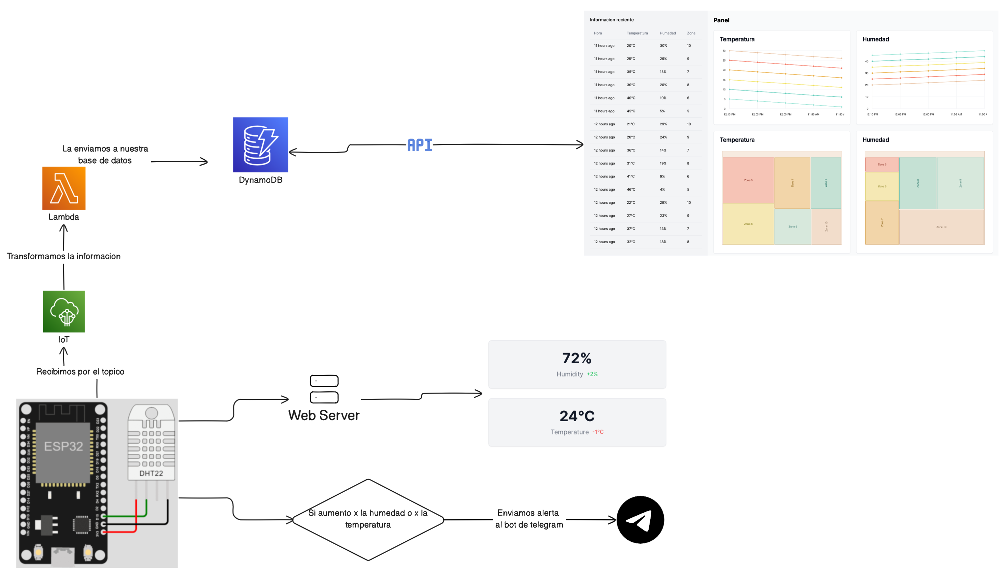

# Monitor de Temperatura

La idea es crear un sistema que pueda estar registrando informacion cada 5 minutos sobre la temperatura/humedad de la tierra.

## Infrestructura

- ESP32
- Sensor de humedad y temperatura
- AWS (DynamoDB, Lambda Functions, IoT)
- Telegram BOT

## Diagrama de Flujo
- Flujo 1

- Flujo 2

## El ESP32:
- Registrara cada 5 minutos la temperatura y humedad.
- Actuara de API para la visual de humedad y temperatura actual.
- Enviara a la nube por protocolo MQTT donde:
  1. Donde se tomara el mensaje y por medio de Lambda se guardara el dato en DynamoDB donde se podra utilizar a posteori para crear un dashboard mas funcional.
  2. Donde se tomara el mensaje y por medio de una Rule IoT se guardara el dato en TimestreamDB donde se podra utilizar a posteori en Amazon Managed Grafana.
- Enviara una alerta a el usuario por medio de un bot de telegram, si la temperatura aumento mas de un 5% o si la humedad aumento un 8% a diferencia de antes.

## Librerias y Tools usadas
- Arduino Esp32fs plugin master (Para subir archivos al ESP32)
- EspAsyncWebServer (Para el webserver)
- AsyncTCP (Para el webserver)
- DHT sensor library (Para el sensor de humedad y temperatura)
- PubSubClient (Para el protocolo MQTT)
- SPIFFS (Para el almacenamiento de archivos en el ESP32)
- HTTPClient (Para el envio al bot de telegram)
- Time (Para el manejo de tiempo)
- WiFi (Para la conexion a internet)
- WiFiClientSecure (Para la conexion a internet)
- Wire (Para la comunicacion I2C)
